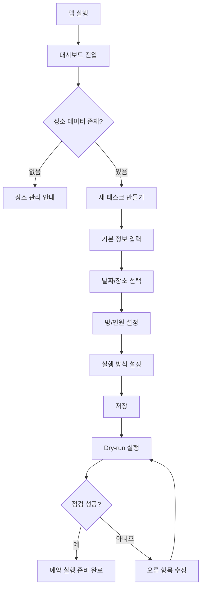
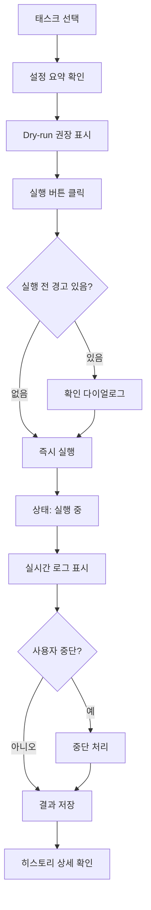
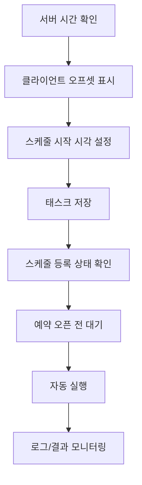

# ITS 예약 관리 시스템 UI/UX 설계서

> **문서명**: ITS 예약 관리 시스템 UI/UX 설계서  
> **대상 제품**: `its-reservation`  
> **기준 문서**: ITS 예약 관리 시스템 PRD v1.0  
> **작성일**: 2026-05-12  
> **대상 사용자**: ITS 건강보험조합 회원 및 로컬 운영자  
> **프론트엔드 기준**: React 18 + Material-UI v6 + Vite  

---

## 1. 설계 목표

본 UI/UX 설계의 핵심 목표는 사용자가 예약 오픈 전에 예약 조건을 안전하게 준비하고, 예약 오픈 시점에는 최소 조작 또는 무조작으로 다수의 날짜·시설 조합을 빠르게 실행할 수 있게 하는 것이다.

### 1.1 UX 핵심 가치

| 가치 | 설명 |
|---|---|
| **사전 준비 중심** | 예약 당일에 입력하지 않도록 태스크, 날짜, 장소, 인원, 실행 방식을 미리 구성한다. |
| **실행 신뢰성** | 예약 실행 전 Dry-run, 서버 시간 확인, 스케줄 상태 확인으로 실패 가능성을 줄인다. |
| **실시간 가시성** | WebSocket 로그와 상태 표시로 현재 무엇이 실행 중인지 즉시 알 수 있게 한다. |
| **빠른 중단과 복구** | 실행 중 오류나 설정 실수를 발견하면 즉시 중단하고 수정할 수 있어야 한다. |
| **로컬 단독 사용 최적화** | 인증/권한보다 빠른 접근성과 단순한 조작 흐름을 우선한다. |

### 1.2 제품 사용 맥락

사용자는 일반적으로 다음과 같은 상황에서 시스템을 사용한다.

1. 예약 오픈 며칠 전 또는 당일 아침에 태스크를 미리 만든다.
2. 여러 숙박일과 시설을 조합해 예약 후보를 구성한다.
3. HTTP 방식 또는 Playwright 방식을 선택한다.
4. Dry-run으로 설정과 사이트 접근 가능 여부를 점검한다.
5. 예약 오픈 직전 서버 시간을 확인한다.
6. 지정 시각에 자동 실행하거나 수동으로 즉시 실행한다.
7. 로그와 히스토리에서 성공/실패 결과를 확인한다.

---

## 2. 사용자 모델

### 2.1 주요 사용자

| 사용자 | 니즈 | UX 고려사항 |
|---|---|---|
| **일반 예약 사용자** | 원하는 날짜와 숙소를 빠르게 예약하고 싶다. | 전문 용어를 줄이고, 필수 입력 누락을 명확히 안내한다. |
| **반복 예약 사용자** | 여러 날짜·장소 조합을 반복적으로 시도하고 싶다. | 태스크 복제, 다중 날짜 선택, 장소 필터링이 중요하다. |
| **로컬 운영자** | 시스템 실행 상태와 로그를 관리하고 싶다. | 스케줄 상태, WebSocket 연결 상태, 히스토리 확인이 중요하다. |

### 2.2 사용자 숙련도 가정

- Node.js 로컬 실행은 가능하나, 예약 사이트 내부 파라미터나 HTTP 요청 구조는 모를 수 있다.
- Cron 표현식, Burst Retry, Playwright 등은 고급 설정으로 분리한다.
- 기본 흐름은 “태스크 만들기 → Dry-run → 예약 실행 → 결과 확인”으로 단순화한다.

---

## 3. 정보 구조 IA

### 3.1 전체 내비게이션

상단 탭 또는 좌측 내비게이션 기반으로 다음 화면을 제공한다.

```text
ITS 예약 관리 시스템
├─ 대시보드
├─ 태스크
│  ├─ 태스크 목록
│  └─ 태스크 편집
├─ 실행
│  ├─ 실행 패널
│  └─ 실시간 로그
├─ 히스토리
├─ 장소 관리
└─ 설정 / 상태
   ├─ 스케줄 상태
   └─ 예약 서버 시간
```

### 3.2 권장 레이아웃

로컬 웹앱이므로 복잡한 글로벌 내비게이션보다 “작업판” 느낌의 2~3분할 레이아웃을 권장한다.

```text
┌──────────────────────────────────────────────────────────────┐
│ Header                                                       │
│ ITS 예약 관리 시스템 | 서버시간 | WS 상태 | 전체 실행 버튼     │
├───────────────┬──────────────────────────────┬───────────────┤
│ TaskList      │ Main Panel                   │ Side Panel    │
│               │ - TaskEditor                 │ - Execution   │
│ - 검색        │ - Dashboard                   │ - Dry-run     │
│ - 필터        │ - History Detail             │ - Logs        │
│ - 태스크 카드 │                              │               │
└───────────────┴──────────────────────────────┴───────────────┘
```

### 3.3 화면 우선순위

| 우선순위 | 화면 | 이유 |
|---|---|---|
| P0 | 태스크 목록/편집 | 핵심 예약 조건을 만드는 주 화면 |
| P0 | 실행 패널/로그 | 예약 실행 시점에 가장 자주 보는 화면 |
| P0 | Dry-run 결과 | 실행 전 실패 가능성을 줄이는 안전장치 |
| P1 | 히스토리 | 실행 결과 분석 및 재시도 판단 |
| P1 | 장소 관리 | 장소 데이터 관리 |
| P2 | 스케줄/서버시간 상태 | 고급 확인 기능이지만 예약 오픈 타이밍에 중요 |

---

## 4. 핵심 사용자 흐름

### 4.1 첫 사용 흐름



### 4.2 수동 실행 흐름



### 4.3 예약 오픈 전 준비 흐름



---

## 5. 화면별 UI 설계

## 5.1 공통 App Shell

### 목적

앱의 현재 상태, 서버 시간, WebSocket 연결, 전체 실행 가능 여부를 항상 확인할 수 있게 한다.

### 구성 요소

| 영역 | 요소 | 설명 |
|---|---|---|
| Header Left | 제품명 | `ITS 예약 관리 시스템` |
| Header Center | 예약 서버 시간 | 서버 시각, 클라이언트 오프셋, RTT 표시 |
| Header Right | 상태 칩 | WebSocket 연결, 스케줄 수, 실행 중 태스크 수 |
| Header Action | 전체 실행 버튼 | 활성 태스크 전체 실행 |

### 상태 표시

| 상태 | 표시 예시 |
|---|---|
| WebSocket 연결됨 | `실시간 연결됨` |
| WebSocket 끊김 | `실시간 연결 끊김` + 재연결 안내 |
| 실행 중 태스크 있음 | `실행 중 3개` |
| 스케줄 등록 있음 | `스케줄 5개 등록` |

### 와이어프레임

```text
┌──────────────────────────────────────────────────────────────┐
│ ITS 예약 관리 시스템                                         │
│ 서버 09:59:58.232 | 오프셋 +124ms | RTT 42ms                 │
│ [실시간 연결됨] [스케줄 3] [실행 중 0] [전체 실행]           │
└──────────────────────────────────────────────────────────────┘
```

---

## 5.2 대시보드

### 목적

예약 실행 준비 상태를 한눈에 보여주는 시작 화면이다.

### 주요 카드

| 카드 | 내용 |
|---|---|
| **오늘의 준비 상태** | 활성 태스크 수, Dry-run 통과 여부, 스케줄 등록 수 |
| **예약 서버 시간** | 서버 시간, 오프셋, RTT, 마지막 확인 시각 |
| **다가오는 스케줄** | 가까운 예약 실행 예정 태스크 3~5개 |
| **최근 실행 결과** | 성공/실패/중단 히스토리 요약 |
| **주의 필요 항목** | 이메일 누락, 날짜 없음, 장소 없음, 과거 스케줄 등 |

### UX 포인트

- 예약 당일에는 대시보드만 봐도 “준비 완료인지” 판단할 수 있어야 한다.
- `Dry-run 미실행`, `과거 시각 스케줄`, `조합 100개 초과` 같은 리스크를 상단에 경고로 표시한다.

### 와이어프레임

```text
┌────────────────────────────────────────────┐
│ 준비 상태                                  │
│ 활성 태스크 4개 | Dry-run 통과 3개 | 경고 1개 │
├────────────────────────────────────────────┤
│ 다음 스케줄                                │
│ 2026-05-20 10:00  여름 예약 A              │
│ 2026-05-20 10:00  여름 예약 B              │
├────────────────────────────────────────────┤
│ 주의 필요                                  │
│ ⚠ 태스크 “겨울 예약”의 예약 시각이 과거입니다. │
└────────────────────────────────────────────┘
```

---

## 5.3 태스크 목록 TaskList

### 목적

예약 태스크를 빠르게 찾고, 현재 상태를 확인하고, 실행/편집/복제/삭제할 수 있게 한다.

### 목록 카드 정보

| 정보 | 설명 |
|---|---|
| 태스크명 | 사용자가 지정한 이름 |
| 활성화 여부 | enabled 상태 |
| 예약 방식 | HTTP / Playwright |
| 날짜 수 | 선택된 예약 날짜 개수 |
| 장소 수 | 선택된 장소 개수 또는 전체 장소 |
| 예상 조합 수 | `dates × places`, 최대 100 제한 안내 |
| 시작 모드 | 수동 / 스케줄 |
| 실행 상태 | 대기 / 실행 중 / 성공 / 실패 / 중단 |
| 마지막 실행 결과 | 최근 히스토리 요약 |

### 필터

| 필터 | 옵션 |
|---|---|
| 상태 | 전체, 활성, 비활성, 실행 중, 오류 있음 |
| 방식 | 전체, HTTP, Playwright |
| 시작 모드 | 전체, 수동, 스케줄 |
| Dry-run | 전체, 통과, 실패, 미실행 |

### 액션

| 액션 | 동작 |
|---|---|
| 새 태스크 | 빈 편집 폼 생성 |
| 복제 | 기존 태스크 기반으로 새 태스크 생성 |
| 실행 | 해당 태스크 즉시 실행 |
| 중단 | 실행 중인 태스크 중단 |
| 삭제 | 확인 후 삭제, 스케줄 자동 해제 |

### 와이어프레임

```text
┌──────────────────────────────┐
│ 태스크                       │
│ [검색어 입력] [+ 새 태스크]  │
├──────────────────────────────┤
│ ● 여름 예약 1                │
│ HTTP | 날짜 3 | 장소 5       │
│ 조합 15 | 스케줄 10:00       │
│ [실행] [복제] [삭제]         │
├──────────────────────────────┤
│ ○ 테스트 태스크              │
│ Playwright | 날짜 1 | 장소 전체 │
│ 조합 23 | 수동               │
│ [실행] [복제] [삭제]         │
└──────────────────────────────┘
```

---

## 5.4 태스크 편집 TaskEditor

### 목적

예약 실행에 필요한 모든 조건을 단계적으로 입력하고 검증한다.

### 권장 구조

태스크 편집은 긴 단일 폼보다 섹션형 Accordion 또는 Stepper 구성이 적합하다.

```text
1. 기본 정보
2. 예약 조건
3. 방/인원
4. 실행 방식
5. 집중 재시도
6. 저장 전 요약
```

---

### 5.4.1 기본 정보 섹션

| 필드 | 타입 | 필수 | 설명 |
|---|---|---:|---|
| 태스크 이름 | TextField | 예 | 목록에 표시될 이름 |
| 활성화 | Switch | 아니오 | 전체 실행/스케줄 대상 포함 여부 |
| 예약 방식 | Segmented Control | 예 | HTTP / Playwright |
| 이메일 | TextField | 예 | 최종 예약 제출용 이메일 |

#### UX 정책

- HTTP 방식은 `Dry-run 가능` 배지를 표시한다.
- Playwright 방식은 `Dry-run 미지원` 안내를 표시한다.
- 이메일 형식이 잘못되면 저장 전 즉시 오류 표시한다.

---

### 5.4.2 예약 조건 섹션

#### 날짜 선택

| 기능 | 설명 |
|---|---|
| 다중 날짜 선택 | 여러 숙박일을 한번에 선택 |
| 날짜 칩 표시 | 선택된 날짜를 칩으로 나열 |
| 시즌 자동 판정 | 날짜에 따라 summer/winter/all 장소 필터링 |
| 과거 날짜 제한 | 과거 날짜는 선택 불가 또는 경고 |

#### 장소 선택

| 필드 | 타입 | 설명 |
|---|---|---|
| 장소 선택 모드 | Radio | 전체 장소 / 선택 장소 |
| 지역 필터 | Select / Chips | 関東, 中部, 近畿, 九州, 沖縄 등 |
| 시즌 필터 | 자동 | 선택 날짜 기준으로 이용 가능 장소만 우선 표시 |
| 장소 목록 | Checkbox List | 시설명, 지역, 시즌 표시 |

#### 조합 수 안내

항상 `날짜 수 × 장소 수 = 예상 실행 조합 수`를 표시한다.

| 조건 | 표시 |
|---|---|
| 1~50개 | 일반 정보 |
| 51~100개 | 주의 안내 |
| 100개 초과 | 경고, 실제 실행은 100개로 제한됨 |

#### 와이어프레임

```text
┌────────────────────────────────────────────┐
│ 예약 조건                                  │
│ 날짜                                       │
│ [2026-08-10] [2026-08-11] [+ 날짜 추가]    │
│                                            │
│ 장소 선택                                  │
│ ( ) 전체 장소  (●) 선택 장소               │
│ 지역: [전체 v] 시즌: 선택 날짜 기준 자동   │
│                                            │
│ ☑ ホテルハーヴェスト 旧軽井沢 | 中部 | all │
│ ☑ トスラブ箱根 和奏林       | 関東 | all  │
│ ☐ 夏期限定施設              | 関東 | summer │
│                                            │
│ 예상 조합: 날짜 2 × 장소 3 = 6개           │
└────────────────────────────────────────────┘
```

---

### 5.4.3 방/인원 섹션

| 필드 | 타입 | 제약 |
|---|---|---|
| 방 수 | Number Input / Stepper | 1~10 |
| 방별 인원수 | Number Input 배열 | 방 수와 길이 일치 |
| 동시 실행 수 | Number Input | 기본 1, 시스템 상한 고려 |

#### UX 정책

- 방 수를 변경하면 `peoplePerRoom` 입력 행을 자동 증감한다.
- 방별 인원이 비어 있으면 저장 불가.
- `numRooms`보다 사용 가능 방 수가 적을 수 있음을 안내한다.

#### 와이어프레임

```text
┌────────────────────────────────┐
│ 방/인원                         │
│ 방 수: [-] 2 [+]                │
│ 1번 방 인원: [-] 3 [+]          │
│ 2번 방 인원: [-] 3 [+]          │
│ 동시 실행 수: 1                 │
└────────────────────────────────┘
```

---

### 5.4.4 실행 방식 섹션

#### 시작 모드

| 모드 | UI | 설명 |
|---|---|---|
| 수동 | Radio | 버튼 클릭 시 실행 |
| 스케줄 | DateTime Picker | 지정 시각 자동 실행 |

#### 실행 모드

| 모드 | UI | 설명 |
|---|---|---|
| 1회 실행 | Radio | 한 번만 실행 |
| 반복 실행 | Interval + MaxRuns | N초 간격으로 M회 실행 |
| Cron 실행 | Cron TextField | Cron 표현식으로 정기 실행 |

#### UX 정책

- 스케줄 시간이 과거이면 저장 불가.
- Cron 입력 시 기본 예시를 함께 제공한다.
- 반복 실행 최대 횟수는 10,000회 초과 불가.
- 예약 오픈 시각에 맞춘 사용을 위해 서버 시간 오프셋을 근처에 표시한다.

#### 와이어프레임

```text
┌────────────────────────────────────────────┐
│ 실행 방식                                  │
│ 시작 모드                                  │
│ (●) 수동 실행  ( ) 스케줄 실행             │
│                                            │
│ 실행 모드                                  │
│ (●) 1회  ( ) 반복  ( ) Cron                │
│                                            │
│ 서버 시간: 09:59:58.232 | 오프셋 +124ms    │
└────────────────────────────────────────────┘
```

---

### 5.4.5 집중 재시도 Burst Retry 섹션

### 목적

예약 오픈 직후 짧은 시간 동안 집중 재시도를 수행하는 고급 설정이다.

| 필드 | 타입 | 기본값 | 제약 |
|---|---|---:|---|
| 활성화 | Switch | false | - |
| 최대 시도 횟수 | Number Input | 10 | 1~50 |
| 재시도 간격 | Number Input | 300ms | 100~5,000ms |
| 최대 총 재시도 시간 | Number Input | 10,000ms | 500~60,000ms |
| 방 없음도 재시도 | Checkbox | false | - |

#### UX 정책

- 기본은 접혀 있는 고급 설정으로 둔다.
- 값을 과도하게 낮게 설정하면 서버 부하 가능성 안내를 표시한다.
- `방 없음도 재시도`는 설명 툴팁을 반드시 제공한다.

---

### 5.4.6 저장 전 요약

저장 버튼 위에는 실행 조건 요약을 제공한다.

```text
예약 방식: HTTP
날짜: 2026-08-10, 2026-08-11
장소: 선택 5개
예상 조합: 10개
방: 2개 / 인원: 3명, 3명
시작: 2026-05-20 10:00:00 자동 실행
실행: 1회
집중 재시도: 활성, 최대 10회
```

### 저장 버튼 상태

| 조건 | 버튼 상태 |
|---|---|
| 필수값 정상 | 활성 |
| 필수값 누락 | 비활성 + 오류 위치 표시 |
| 조합 100 초과 | 활성 가능, 단 경고 다이얼로그 표시 |
| 과거 스케줄 | 비활성 |

---

## 5.5 실행 패널 ExecutionPanel

### 목적

선택 태스크 또는 활성 태스크 전체를 실행하고, 실행 상태를 제어한다.

### 구성

| 요소 | 설명 |
|---|---|
| 선택 태스크 요약 | 이름, 방식, 조합 수, 스케줄 여부 |
| 실행 버튼 | 단일 태스크 즉시 실행 |
| 전체 실행 버튼 | 활성 태스크 전체 실행 |
| 중단 버튼 | 실행 중 태스크 중단 |
| Dry-run 버튼 | HTTP 방식에서만 활성 |
| 상태 Progress | 실행 중/완료/실패/중단 표시 |

### 버튼 정책

| 상황 | 실행 | 중단 | Dry-run |
|---|---|---|---|
| 대기 중 HTTP 태스크 | 활성 | 비활성 | 활성 |
| 대기 중 Playwright 태스크 | 활성 | 비활성 | 비활성 |
| 실행 중 | 비활성 | 활성 | 비활성 |
| 필수 설정 오류 | 비활성 | 비활성 | 비활성 |

### 와이어프레임

```text
┌────────────────────────────────────┐
│ 실행 패널                           │
│ 선택 태스크: 여름 예약 1            │
│ HTTP | 조합 15 | Dry-run 통과        │
│                                    │
│ [Dry-run] [실행] [중단]             │
│ 상태: 대기 중                       │
└────────────────────────────────────┘
```

---

## 5.6 Dry-run 결과 화면

### 목적

실제 예약 없이 설정과 사이트 접근 가능 여부를 점검한다.

### 결과 구조

| 항목 | 표시 |
|---|---|
| 전체 결과 | 성공 / 경고 / 실패 |
| 점검 조합 수 | 최대 10개 |
| 점검 항목 | 장소, 날짜, 이메일, 방/인원, 초기 페이지, 토큰, 날짜 옵션 |
| 상세 메시지 | 실패 원인과 수정 가이드 |

### 결과 표현

```text
┌────────────────────────────────────────────┐
│ Dry-run 결과: 실패                         │
│ 점검 조합: 10개 중 8개 성공, 2개 실패       │
├────────────────────────────────────────────┤
│ ✅ 이메일 입력 확인                         │
│ ✅ 초기 페이지 HTTP 200                     │
│ ✅ Authenticity Token 추출                  │
│ ⚠ 일부 날짜가 드롭다운 옵션에 없습니다.     │
│ ❌ 장소 queryString 누락: 시설 A             │
└────────────────────────────────────────────┘
```

### UX 정책

- 실패 항목은 바로 수정 가능한 화면으로 이동 링크를 제공한다.
- `Playwright 방식은 Dry-run을 지원하지 않습니다.`를 버튼 영역에 표시한다.
- 최근 Dry-run 결과를 태스크 카드에도 요약 표시한다.

---

## 5.7 실시간 로그 LogViewer

### 목적

예약 실행 중 발생하는 이벤트를 시간순으로 보여준다.

### 로그 레벨

| 레벨 | 용도 |
|---|---|
| info | 일반 진행 상황 |
| success | 예약 성공, 점검 성공 |
| warning | 재시도, 방 부족, 제한 적용 |
| error | 네트워크 오류, 서버 오류, 파싱 실패 |
| debug | 고급 상세 로그, 기본 접힘 |

### 기능

| 기능 | 설명 |
|---|---|
| 자동 스크롤 | 새 로그 수신 시 하단으로 이동 |
| 일시 정지 | 사용자가 과거 로그를 읽을 때 자동 스크롤 중지 |
| 필터 | 전체, 성공, 경고, 오류 |
| 검색 | 로그 메시지 검색 |
| 복사 | 현재 로그 전체 클립보드 복사 |
| 내보내기 | 텍스트 또는 JSON 다운로드 고려 |

### 와이어프레임

```text
┌────────────────────────────────────────────┐
│ 실시간 로그       [전체 v] [검색...] [복사] │
├────────────────────────────────────────────┤
│ 09:59:59.900 INFO  실행 준비                │
│ 10:00:00.001 INFO  조합 1/15 시작           │
│ 10:00:00.248 WARN  빈 방 없음, 재시도 예정  │
│ 10:00:00.552 SUCCESS 예약 성공              │
└────────────────────────────────────────────┘
```

### UX 정책

- 예약 성공 로그는 눈에 띄게 표시한다.
- 오류 로그는 접을 수 있는 상세 영역을 제공한다.
- 실행 중 로그가 과도하게 많을 수 있으므로 가상 스크롤 적용을 권장한다.

---

## 5.8 히스토리 HistoryViewer

### 목적

과거 실행 결과를 확인하고 다음 실행 전략을 조정할 수 있게 한다.

### 목록 정보

| 필드 | 설명 |
|---|---|
| 실행 태스크명 | 당시 태스크 이름 |
| 시작/완료 시각 | 실행 기간 |
| 상태 | 성공 / 실패 / 일부 성공 / 중단 |
| 성공 조합 수 | 예약 성공 개수 |
| 실패 조합 수 | 실패 또는 방 없음 개수 |
| 실행 방식 | HTTP / Playwright |

### 상세 정보

| 영역 | 내용 |
|---|---|
| 요약 | 전체 상태, 소요 시간, 성공률 |
| 조합별 결과 | 날짜, 장소, 상태 코드, 메시지 |
| 로그 전체 | 해당 실행의 로그 |
| 재사용 액션 | 같은 조건으로 태스크 복제 |

### 와이어프레임

```text
┌────────────────────────────────────────────┐
│ 실행 히스토리                              │
├────────────────────────────────────────────┤
│ 2026-05-20 10:00 여름 예약 1               │
│ 일부 성공 | 성공 1 | 실패 14 | HTTP        │
│ [상세 보기] [태스크로 복제]                │
└────────────────────────────────────────────┘
```

### 결과 상태 정의

| 상태 | 정의 |
|---|---|
| success | 하나 이상의 예약 성공 또는 모든 조합 성공 |
| partial | 일부 성공, 일부 실패 |
| failed | 모든 조합 실패 |
| cancelled | 사용자가 중단 |
| error | 시스템 오류로 정상 완료 불가 |

---

## 5.9 장소 관리 PlaceManager

### 목적

예약 대상 숙박 시설 목록과 queryString, 시즌 정보를 관리한다.

### 목록 컬럼

| 컬럼 | 설명 |
|---|---|
| ID | 장소 키 |
| 시설명 | name |
| 지역 | region |
| 시즌 | all / summer / winter / 복수 |
| queryString | 일부 마스킹 표시 |
| 상태 | 정상 / queryString 누락 |
| 액션 | 수정 / 삭제 |

### 편집 폼

| 필드 | 타입 | 필수 |
|---|---|---:|
| 장소 ID | TextField | 예 |
| 시설명 | TextField | 예 |
| 지역 | Select | 예 |
| queryString | TextArea | 예 |
| 시즌 | Multi Select | 예 |

### UX 정책

- queryString은 긴 문자열이므로 기본적으로 앞뒤 일부만 표시한다.
- 장소 삭제 시 해당 장소를 사용하는 태스크 목록을 안내한다.
- 시즌이 맞지 않는 장소가 태스크 편집 화면에서 왜 숨겨졌는지 확인할 수 있도록 `필터링 사유` 툴팁을 제공한다.

---

## 5.10 스케줄 상태 화면

### 목적

현재 서버에 등록된 자동 실행 스케줄을 확인한다.

### 표시 항목

| 항목 | 설명 |
|---|---|
| 등록된 스케줄 수 | 전체 카운트 |
| 태스크명 | 연결된 태스크 |
| 다음 실행 시각 | 예정 시각 |
| 실행 모드 | once / repeat / cron |
| 상태 | 등록됨 / 만료됨 / 오류 |

### UX 정책

- 서버 재시작 후 스케줄 누락 가능성을 확인할 수 있게 “마지막 스케줄 초기화 시각” 표시를 권장한다.
- 과거 시각이거나 등록 실패한 태스크는 대시보드 경고에도 노출한다.

---

## 5.11 예약 서버 시간 화면

### 목적

예약 오픈 타이밍을 맞추기 위해 예약 서버와 로컬 클라이언트의 시간 차이를 확인한다.

### 표시 정보

| 항목 | 설명 |
|---|---|
| 예약 서버 시각 | API에서 조회한 서버 시간 |
| 클라이언트 시각 | 현재 브라우저 시간 |
| 오프셋 | 서버 시간 - 클라이언트 시간 |
| RTT | 요청 왕복 시간 |
| 마지막 동기화 | 마지막 조회 시각 |

### UX 정책

- 헤더에도 간략 표시하고, 상세는 설정/상태 화면에서 제공한다.
- 예약 오픈 5분 전부터는 “서버 시간 새로고침” 버튼을 강조한다.
- 오프셋이 크면 스케줄 설정 시 참고 안내를 표시한다.

---

## 6. 상태 및 피드백 설계

### 6.1 태스크 상태

| 상태 | 의미 | UI 표시 |
|---|---|---|
| idle | 대기 중 | 회색 칩 |
| ready | 실행 준비 완료 | 초록 칩 |
| warning | 실행 가능하나 주의 필요 | 노란 칩 |
| invalid | 필수 설정 오류 | 빨간 칩 |
| running | 실행 중 | Progress + 중단 버튼 |
| success | 최근 실행 성공 | 성공 칩 |
| failed | 최근 실행 실패 | 오류 칩 |
| cancelled | 최근 실행 중단 | 중립 칩 |

### 6.2 실행 결과 코드 표시

| 코드 | 사용자 메시지 |
|---|---|
| `success` | 예약에 성공했습니다. |
| `no_rooms` | 빈 방이 없습니다. |
| `insufficient_rooms` | 요청한 방 수보다 사용 가능한 방이 적습니다. |
| `date_not_available` | 선택한 날짜는 예약할 수 없습니다. |
| `empty` | 만실입니다. |
| `error` | 네트워크 또는 서버 오류가 발생했습니다. |
| `cancelled` | 사용자가 실행을 중단했습니다. |

### 6.3 로딩 상태

| 상황 | UX |
|---|---|
| 태스크 목록 로딩 | Skeleton 카드 표시 |
| 저장 중 | 저장 버튼 로딩 + 폼 비활성화 |
| 실행 시작 중 | 실행 버튼 로딩 |
| Dry-run 중 | 점검 항목별 진행 상태 표시 |
| 히스토리 로딩 | 표 Skeleton |

### 6.4 빈 상태 Empty State

| 화면 | 메시지 | 액션 |
|---|---|---|
| 태스크 없음 | 아직 예약 태스크가 없습니다. | 새 태스크 만들기 |
| 히스토리 없음 | 아직 실행 기록이 없습니다. | 태스크 실행하기 |
| 장소 없음 | 등록된 장소가 없습니다. | 장소 추가하기 |
| 로그 없음 | 실행을 시작하면 로그가 표시됩니다. | 실행 패널로 이동 |

---

## 7. 입력 검증 정책

### 7.1 저장 전 검증

| 항목 | 검증 |
|---|---|
| 태스크 이름 | 빈 값 불가 |
| 이메일 | 빈 값 불가, 이메일 형식 확인 |
| 날짜 | 1개 이상 필요 |
| 장소 | selected 모드에서 1개 이상 필요 |
| 방 수 | 1~10 |
| 방별 인원 | 방 수와 배열 길이 일치, 각 값 필수 |
| 예약 방식 | HTTP 또는 Playwright 필수 |
| 스케줄 시간 | 현재보다 미래여야 함 |
| 반복 횟수 | 최대 10,000회 이하 |
| Burst Retry | 각 범위 내 값만 허용 |

### 7.2 실행 전 검증

| 항목 | 처리 |
|---|---|
| 예상 조합 100개 초과 | 경고 후 100개 제한 적용 안내 |
| Dry-run 실패 | 실행 가능하되 확인 다이얼로그 표시 |
| WebSocket 끊김 | 실행 가능하되 로그 실시간 확인 불가 안내 |
| 예약 서버 시간 미확인 | 수동 실행은 허용, 스케줄 실행은 주의 표시 |

---

## 8. 컴포넌트 설계

### 8.1 컴포넌트 계층

```text
App
├─ AppHeader
│  ├─ ServerTimeBadge
│  ├─ WebSocketStatusBadge
│  └─ GlobalExecutionButton
├─ Layout
│  ├─ TaskList
│  │  ├─ TaskFilterBar
│  │  └─ TaskCard
│  ├─ MainContent
│  │  ├─ Dashboard
│  │  ├─ TaskEditor
│  │  ├─ HistoryViewer
│  │  └─ PlaceManager
│  └─ SidePanel
│     ├─ ExecutionPanel
│     ├─ DryRunResult
│     └─ LogViewer
└─ Common
   ├─ StatusChip
   ├─ ConfirmDialog
   ├─ FormSection
   ├─ CombinationSummary
   └─ ErrorBanner
```

### 8.2 주요 컴포넌트 책임

| 컴포넌트 | 책임 |
|---|---|
| `TaskList` | 태스크 목록 조회, 선택, 검색/필터 |
| `TaskCard` | 태스크 요약과 빠른 액션 표시 |
| `TaskEditor` | 태스크 생성/수정 폼 관리 |
| `CombinationSummary` | 날짜×장소 조합 수 계산 및 경고 |
| `ExecutionPanel` | 실행, 중단, Dry-run 트리거 |
| `DryRunResult` | 사전 점검 결과 표시 |
| `LogViewer` | WebSocket 로그 표시, 필터/검색 |
| `HistoryViewer` | 실행 히스토리 목록/상세 |
| `PlaceManager` | 장소 CRUD |
| `ServerTimeBadge` | 예약 서버 시간과 오프셋 표시 |
| `WebSocketStatusBadge` | 실시간 연결 상태 표시 |

---

## 9. API 연동 설계

### 9.1 REST API 매핑

| 화면/기능 | API |
|---|---|
| 태스크 목록 | `GET /api/tasks` |
| 태스크 저장 | `POST /api/tasks` |
| 태스크 삭제 | `DELETE /api/tasks/:id` |
| 단일 실행 | `POST /api/execution/start/:taskId` |
| 전체 실행 | `POST /api/execution/start-all` |
| 실행 중단 | `POST /api/execution/stop/:taskId` |
| Dry-run | `POST /api/execution/dry-run/:taskId` |
| 장소 목록 | `GET /api/places` |
| 장소 저장 | `POST /api/places` |
| 히스토리 | `GET /api/history` |
| 스케줄 상태 | `GET /api/schedule/status` |
| 서버 시간 | `GET /api/reservation/server-time` |

### 9.2 WebSocket 이벤트 처리

| 이벤트 | UI 반영 |
|---|---|
| `execution:log` | LogViewer에 append |
| `execution:status` | TaskCard, ExecutionPanel 상태 갱신 |

### 9.3 클라이언트 상태 관리 권장

작은 규모에서는 React Context + custom hooks로 충분하다.

```text
contexts/
├─ TaskContext
├─ ExecutionContext
├─ LogContext
├─ PlaceContext
└─ AppStatusContext
```

권장 hooks:

| Hook | 역할 |
|---|---|
| `useTasks()` | 태스크 조회/저장/삭제 |
| `useExecution()` | 실행/중단/Dry-run |
| `usePlaces()` | 장소 조회/저장 |
| `useWebSocketLogs()` | 로그 연결 및 이벤트 수신 |
| `useServerTime()` | 서버 시간 조회 |
| `useScheduleStatus()` | 스케줄 상태 조회 |

---

## 10. 반응형 설계

### 10.1 데스크톱 우선

예약 실행과 로그 확인이 중요하므로 기본은 데스크톱 레이아웃이다.

| 화면 너비 | 레이아웃 |
|---|---|
| 1280px 이상 | 3분할: TaskList / Main / SidePanel |
| 960~1279px | 2분할: TaskList / Main, 로그는 하단 Drawer |
| 600~959px | 탭 기반 단일 컬럼 |
| 599px 이하 | 최소 지원, 실행/로그 확인 중심 |

### 10.2 모바일 대응 정책

모바일은 예약 실행 상태 확인과 긴급 중단 중심으로 제한한다.

| 기능 | 모바일 UX |
|---|---|
| 실행/중단 | 큰 버튼으로 상단 고정 |
| 로그 | 전체 화면 Drawer |
| 태스크 편집 | Stepper 단일 컬럼 |
| 장소 관리 | 간소화 또는 데스크톱 권장 안내 |

---

## 11. 접근성 및 사용성

### 11.1 접근성 기준

| 항목 | 기준 |
|---|---|
| 키보드 조작 | 주요 버튼과 폼은 Tab 이동 가능 |
| 명도 대비 | 상태 칩과 오류 메시지는 색상 외 텍스트도 함께 표시 |
| 스크린리더 | 버튼에는 명확한 aria-label 제공 |
| 오류 안내 | 필드 바로 아래에 오류 이유 표시 |
| 움직임 | 자동 스크롤은 사용자가 중지 가능 |

### 11.2 사용성 원칙

- 실행 버튼은 항상 “어떤 태스크가 실행되는지” 근처에 둔다.
- 삭제, 전체 실행, Dry-run 실패 상태에서의 실행은 확인 다이얼로그를 사용한다.
- 고급 설정은 기본 접힘 상태로 두어 초보 사용자의 인지 부담을 줄인다.
- 모든 시간은 초 단위까지 표시하되, 서버 시간은 밀리초까지 표시한다.

---

## 12. 문구 가이드

### 12.1 버튼 문구

| 기능 | 문구 |
|---|---|
| 태스크 생성 | 새 태스크 만들기 |
| 저장 | 저장 |
| 복제 | 복제 |
| 단일 실행 | 이 태스크 실행 |
| 전체 실행 | 활성 태스크 전체 실행 |
| 중단 | 실행 중단 |
| Dry-run | Dry-run 점검 |
| 로그 복사 | 로그 복사 |

### 12.2 안내 문구

| 상황 | 문구 |
|---|---|
| Dry-run 성공 | 사전 점검을 통과했습니다. 예약 실행 준비가 완료되었습니다. |
| Dry-run 실패 | 일부 항목에서 문제가 발견되었습니다. 아래 항목을 수정한 뒤 다시 점검하세요. |
| Playwright Dry-run 미지원 | Playwright 방식은 현재 Dry-run을 지원하지 않습니다. |
| 조합 수 초과 | 실행 조합이 100개를 초과합니다. 실제 실행은 최대 100개까지만 처리됩니다. |
| 과거 스케줄 | 현재보다 과거 시각은 스케줄로 등록할 수 없습니다. |
| WebSocket 끊김 | 실시간 로그 연결이 끊겼습니다. 실행은 가능하지만 로그가 지연될 수 있습니다. |

---

## 13. 디자인 토큰 제안

### 13.1 컬러 역할

| 토큰 | 용도 |
|---|---|
| `primary` | 주요 액션, 선택 상태 |
| `success` | 예약 성공, Dry-run 성공 |
| `warning` | 주의, 재시도, 조합 수 많음 |
| `error` | 오류, 실패, 저장 불가 |
| `info` | 서버 시간, 상태 정보 |
| `neutral` | 대기, 비활성, 보조 정보 |

### 13.2 상태 아이콘

| 상태 | 아이콘 의미 |
|---|---|
| 성공 | 체크 |
| 실패 | 오류 원형 |
| 경고 | 삼각 경고 |
| 실행 중 | 회전 Progress |
| 스케줄 | 시계 |
| 수동 실행 | 플레이 |
| 중단 | 정지 |

---

## 14. 주요 예외 케이스 UX

| 예외 | UX 처리 |
|---|---|
| 장소 시즌 불일치 | 장소 목록에서 비활성 표시 또는 필터링 사유 표시 |
| queryString 누락 | 저장 가능 여부는 정책에 따라 결정하되 실행 전 강한 경고 |
| HTTP 토큰 추출 실패 | Dry-run 결과에서 실패 원인과 재시도 안내 |
| 방 부족 | `insufficient_rooms`로 표시하고 요청 방 수 확인 링크 제공 |
| 예약 서버 응답 지연 | 로그에 RTT/지연 안내, 실행은 계속 |
| 사용자가 실행 중 페이지 이동 | Header와 SidePanel에 실행 상태 유지 |
| 서버 재시작 | WebSocket 재연결, 스케줄 상태 재조회 |
| JSON 저장 실패 | 저장 실패 배너와 재시도 버튼 표시 |

---

## 15. MVP 구현 범위

### Phase 1: 핵심 사용 가능 상태

- App Shell
- TaskList
- TaskEditor
- ExecutionPanel
- LogViewer
- Dry-run 결과
- HistoryViewer 기본 목록
- PlaceManager 기본 CRUD

### Phase 2: 안정성 강화

- Dashboard
- Schedule Status
- ServerTimeBadge
- 태스크 복제
- 로그 필터/검색/복사
- 히스토리 상세

### Phase 3: 고급 UX

- Cron 입력 도우미
- Dry-run 결과 기반 자동 수정 링크
- 예약 성공 알림
- 태스크 템플릿
- 히스토리 기반 재시도 추천
- 장소 시즌 필터 시각화

---

## 16. 최종 화면 구성 예시

```text
┌────────────────────────────────────────────────────────────────────────────┐
│ ITS 예약 관리 시스템                                                       │
│ 서버 09:59:58.232 | 오프셋 +124ms | [실시간 연결됨] [스케줄 3] [전체 실행] │
├──────────────────────┬─────────────────────────────────┬─────────────────┤
│ 태스크               │ 태스크 편집                      │ 실행 패널        │
│ [검색] [+ 새 태스크] │ 기본 정보                        │ 여름 예약 1      │
│                      │ 예약 방식: HTTP                  │ 조합 15          │
│ ● 여름 예약 1        │ 이메일: user@example.com          │ [Dry-run] [실행] │
│   HTTP | 조합 15     │ 날짜: 2026-08-10, 2026-08-11     │ [중단]           │
│   Dry-run 통과       │ 장소: 선택 5개                    ├─────────────────┤
│                      │ 방: 2개 / 3명, 3명                │ 실시간 로그      │
│ ○ 겨울 예약          │ 실행: 스케줄 10:00                │ 09:59 INFO 준비  │
│   Playwright         │ 집중 재시도: 활성                 │ 10:00 INFO 시작  │
│                      │ [저장]                            │ 10:00 SUCCESS    │
└──────────────────────┴─────────────────────────────────┴─────────────────┘
```

---

## 17. 구현 시 체크리스트

### 태스크 편집

- [ ] 필수 입력 누락 시 저장 버튼 비활성화
- [ ] 날짜 선택에 따라 장소 시즌 필터링
- [ ] 조합 수 실시간 계산
- [ ] 100개 초과 경고 표시
- [ ] 방 수 변경 시 방별 인원 입력 자동 동기화
- [ ] HTTP/Playwright 방식별 안내 표시

### 실행

- [ ] 실행 중 중복 실행 방지
- [ ] 중단 버튼 즉시 활성화
- [ ] Dry-run은 HTTP 방식에서만 노출 또는 활성화
- [ ] 실행 결과 코드별 메시지 매핑
- [ ] WebSocket 끊김 상태 표시

### 로그/히스토리

- [ ] 로그 자동 스크롤 및 정지 기능
- [ ] 로그 레벨 필터
- [ ] 히스토리 상세에서 조합별 결과 확인
- [ ] 같은 조건으로 태스크 복제 기능

### 장소 관리

- [ ] queryString 누락 감지
- [ ] 시즌 다중 선택 지원
- [ ] 장소 삭제 시 영향받는 태스크 안내
- [ ] 태스크 편집 화면에 즉시 반영

---

## 18. 결론

이 UI/UX 설계는 예약 자동화 시스템의 핵심 경험을 “빠르게 누르는 화면”이 아니라 “미리 안전하게 준비하고, 실행 시점에는 흔들리지 않는 조종석”으로 정의한다.  

사용자는 태스크를 미리 만들고, Dry-run으로 점검하고, 서버 시간과 스케줄 상태를 확인한 뒤, 예약 오픈 시점에는 실행과 로그에만 집중하면 된다. 이를 위해 화면은 태스크 편집, 실행 제어, 실시간 로그를 한 시야 안에 배치하고, 고급 설정은 필요할 때만 열리는 구조로 설계한다.
